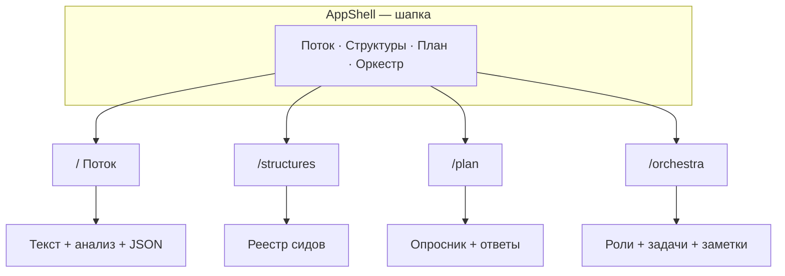

# Обзор интерфейса (model / web)

**Для кого:** новый разработчик, владелец продукта, ассистент в Cursor — без чтения исходников экранов.  
**Как читать:** разделы 0–2 — контекст; 3 — где лежат данные; 4–7 — экраны; 8–9 — справочник; 10–14 — a11y, риски, глоссарий, первый час.

> **Имя репозитория — `model`.** Названия «Мастер», «Проект Мастер» в канонических PDF — про продуктовую идею, не про имя этой кодовой базы.

---

## 0. Паспорт продукта

| | |
|---|---|
| **Что это** | Локальное веб-рабочее место в браузере: структурирование текста («поток»), реестр решений из промптов, опросник плана, планирование ролей вложенных агентов. |
| **Что не это** | Не соцсеть, не облачный SaaS, не запуск агентов Cursor из браузера, не полноценный бэкенд (есть только заготовка `api/` с `GET /health`). |
| **Стек UI** | Vite + React + TypeScript + Tailwind; маршрутизация `react-router-dom`; состояние `zustand` + `localStorage`. |
| **Запуск** | `cd web && npm install && npm run dev` → адрес в терминале (обычно `http://localhost:5173/`). |

**Роли пользователей**

- **Владелец** — вводит текст, отвечает на вопросы плана, ведёт оркестр задач, экспортирует JSON в чат.
- **Ассистент в IDE** — не видит `localStorage`; получает контекст через экспортированные файлы или копипаст.
- **Разработчик** — правит `web/src`, сиды в `promptStructureSeeds.ts`, каноны в корне репозитория.

---

## 1. Карта информационной архитектуры

| Маршрут | Вкладка в шапке | Назначение (одна фраза) |
|---------|-----------------|-------------------------|
| `/` | Поток | Текст, локальный и внешний анализ, связь с канонами |
| `/structures` | Структуры из промптов | Просмотр накопленных решений из диалога (сиды) |
| `/plan` | План: вопросы | Опросник с вариантами; ответы в браузере |
| `/orchestra` | Оркестр | План параллельной работы вложенных агентов в IDE |

Общая оболочка: sticky-шапка «Рабочее место», skip-link **«К основному содержимому»** → `#main-content`. Входа в систему и мультитенанта **нет**.

---

## 2. Глобальные паттерны интерфейса

| Паттерн | Назначение |
|---------|------------|
| **AppButton** | `primary` — главное действие; `ghost` — вторичное (с рамкой); `danger` — необратимое |
| **SurfaceCard** | Секция с заголовком и описанием |
| **ConfirmDialog** | Подтверждение на `<dialog>` (Escape, фокус в модалке) вместо `window.confirm` |
| **Экспорт JSON** | Скачивание файла в браузере (`downloadJson`), без отправки на сервер |

Тёмная тема по умолчанию (`color-scheme: dark` в `index.html`).

---

## 3. Сквозная карта данных (Data map)

| Данные | Где живёт | Ключ / файл | Экспорт отдельно | В «Снимке браузера» |
|--------|-----------|-------------|------------------|---------------------|
| Текст потока (поле на Потоке) | `localStorage` | `model-stream-v1` | В analysis-snapshot и снимке браузера | Да (`stream.masterRawText`) |
| Локальный + внешний анализ | `localStorage` | `model-analysis-v1` | «Экспорт JSON» на Потоке | Да (`analysis`) |
| Ответы опросника плана | `localStorage` | `model-planning-v1` | `plan-answers-*.json` | Да (`planning`) |
| Оркестр: роли, задачи, заметки | `localStorage` | `model-orchestra-v1` | `orchestra-*.json` | Да (`orchestra`) |
| Сиды структур | Код: `promptStructureSeeds.ts` | — | Нет (не пользовательские) | Нет |
| Каноны, SWOD, план | Git, корень `model` | `CANON_*.txt`, `SWOD_ZAKONOV.txt`, `PLAN_REALIZATSII.md` | Ручное копирование в Поток | Нет |
| Мастер-намерение, private | Только диск владельца | `private/*` | Не в Git; не подмешивается автоматически | Нет |

**Важно:** смена браузера или очистка сайта в настройках **удаляет** persist-данные. Агент в Cursor **не** читает `localStorage` — нужен экспорт.

---

## 4. Экран «Поток» (`/`)

### 4.1 Назначение

Главное рабочее место: вставка или загрузка `.txt`, **локальный** разбор (метрики, блоки, ключевые слова) и **внешний** смысловой слой (JSON от модели/агента или встроенные каноны-2/3).

### 4.2 Зоны экрана

1. **Три обзорные карточки** — мастер-текст в браузере, локальный слой, исследование через JSON.
2. **«Тексты канона в репозитории model»** — подсказка открыть в IDE: `CANON_SECONDARY_MASTER.txt`, `CANON_PROJECT_MASTER.txt`, `SWOD_ZAKONOV.txt` (без автозагрузки).
3. **Источник текста** — большое поле, загрузка `.txt`, кнопки:
   - **Локальный анализ**
   - **Сбросить анализ…** (диалог; текст в поле не удаляется)
   - **Экспорт JSON** — снимок анализа + `rawText`
   - **Снимок браузера** — всё из persist (поток, анализ, план, оркестр)
4. После локального анализа — метрики, ключевые слова, список **блоков** с якорями `#analysis-block-0`, …
5. **Глубокий анализ (JSON)** — поле ввода; кнопки **«Проект Мастер (PDF) в слой»**, **«Канон-2 (PDF) в слой»**, **Импортировать JSON**.
6. При успешном внешнем слое — резюме, темы (со ссылками на блоки, если есть `relatedBlockIndices` и локальный анализ), напряжения, гипотезы.

### 4.3 Типовые сценарии

**A. Первый разработчик за 10 минут**  
Вставить абзац → **Локальный анализ** → просмотреть блоки → **Канон-2 (PDF) в слой** → сравнить темы с текстом.

**B. Передать контекст ассистенту**  
Заполнить Поток и при необходимости План/Оркестр → **Снимок браузера** → прикрепить `workspace-browser-….json` в чат.

**C. Работа с каноном из Git**  
Открыть `CANON_PROJECT_MASTER.txt` в IDE → скопировать фрагмент → вставить в поле Потока → локальный анализ.

### 4.4 Состояния и ошибки

| Состояние | Что видит пользователь |
|-----------|-------------------------|
| Пустое поле | Локальный анализ недоступен |
| Невалидный JSON | Сообщение об ошибке импорта (красная плашка) |
| Тема с `relatedBlockIndices`, нет локального анализа | Подсказка: запустить локальный анализ для перехода к блокам |
| Только внешний слой | Темы без ссылок на блоки |

---

## 5. Экран «Структуры из промптов» (`/structures`)

### Назначение

Просмотр **реестра** подтверждённых сущностей и правил из промптов (закон 8 SWOD). Данные — начальный список `DEFAULT_PROMPT_STRUCTURES` в коде; в UI **нет** добавления/редактирования пользователем (только раскрытие карточек).

### Поведение

- Список отсортирован по дате создания (новые сверху).
- Клик по строке — раскрыть: `sourceHint`, `id`, `createdAtIso`, теги.

### Сценарий

Перед планированием фичи открыть вкладку → найти сид по тегу (`canon3`, `orchestra`, `analysis`) → использовать `id` и формулировки в задаче агенту.

---

## 6. Экран «План: вопросы» (`/plan`)

### Назначение

Перманентный опросник: у каждого вопроса — варианты (radio) и поле **«свой вариант»**. Ответы только в этом браузере.

### Действия

| Кнопка | Результат |
|--------|-----------|
| **Экспорт JSON** | `plan-answers-{timestamp}.json`, `version: 1` |
| **Импорт JSON** | Восстановление из поля ввода под кнопками |
| **Очистить ответы…** | Диалог → очистка `model-planning-v1` |

### Сценарий

Пройти вопросы → **Экспорт JSON** → обсудить с ассистентом → при необходимости **Импорт** на другой машине (тот же браузерный профиль не обязателен — достаточно файла).

---

## 7. Экран «Оркестр» (`/orchestra`)

### Назначение

Планирование **параллельной** работы в Cursor: роли агентов (подпись + фокус), задачи со статусами, заметки дирижёра. Приложение **не запускает** subagent’ов.

### Стартовые роли (шаблон)

| Подпись | Тип в Cursor (ориентир) |
|---------|------------------------|
| Исследование | `explore` |
| Общий агент | `generalPurpose` |
| Терминал | `shell` |
| CI | `ci-investigator` |

### Задачи — статусы

`Бэклог` · `В работе` · `Блокер` · `Готово`

### Действия

- **Экспорт / импорт JSON** (`orchestra-*.json`, `version: 1`)
- **Роли по умолчанию** — восстановить шаблон ролей
- **Полный сброс…** — роли, задачи, заметки к шаблону
- Карточка со ссылкой на `PLAN_REALIZATSII.md`

### Сценарий

Создать задачи по фазам плана → назначить роли → экспорт JSON → в чате: «задача X — subagent explore, контекст из orchestra-….json».

---

## 8. Справочник действий

| Действие в UI | Экран | Результат | Файл / ключ |
|---------------|-------|-----------|-------------|
| Загрузить .txt | Поток | Текст в поле | `model-stream-v1` |
| Локальный анализ | Поток | Метрики, блоки, ключевые слова | `model-analysis-v1` (local) |
| Сбросить анализ… | Поток | Очистка local + external | `model-analysis-v1` |
| Экспорт JSON | Поток | `analysis-snapshot-*.json` | — |
| Снимок браузера | Поток | `workspace-browser-*.json` | все persist |
| Канон-2 / Проект Мастер в слой | Поток | Внешний анализ из bundled JSON | `model-analysis-v1` (external) |
| Импортировать JSON | Поток | Ручной ExternalAnalysisV1 | `model-analysis-v1` |
| Экспорт JSON | План | `plan-answers-*.json` | `model-planning-v1` |
| Импорт JSON | План | Замена ответов | `model-planning-v1` |
| Очистить ответы… | План | Пустые ответы | `model-planning-v1` |
| Экспорт / импорт JSON | Оркестр | `orchestra-*.json` | `model-orchestra-v1` |
| Добавить роль / задачу | Оркестр | Новые строки | `model-orchestra-v1` |
| Полный сброс… | Оркестр | Шаблон по умолчанию | `model-orchestra-v1` |

---

## 9. Форматы JSON (верхний уровень)

### ExternalAnalysisV1 (внешний слой на Потоке)

`version: 1`, `generatedAt`, `summary`, `themes[]` (`id`, `title`, `rationale`, опционально `relatedBlockIndices`), `tensions[]`, `hypotheses[]`, опционально `modelHint`.

### Снимок анализа (кнопка «Экспорт JSON»)

`version: 1`, `exportedAt`, `rawText`, `local`, `external`.

### План (`plan-answers-*.json`)

`version: 1`, `exportedAt`, `answers` — объект `{ questionId: { optionId, customText } }`.

### Оркестр (`orchestra-*.json`)

`version: 1`, `exportedAt`, `agents[]`, `tickets[]`, `conductorNotes`.

### Снимок браузера (`workspace-browser-*.json`)

`version: 1`, `exportedAt`, `note`, `stream`, `analysis`, `planning`, `orchestra` — вложенные конверты как выше.

---

## 10. Доступность (a11y)

- Skip-link по Tab → переход к основному содержимому.
- Опасные действия — модальный `<dialog>` с `aria-modal` и подписями.
- Кнопки: минимальная высота/ширина зоны нажатия, видимое `focus-visible:ring`.
- Якоря блоков анализа: `scroll-mt` для учёта sticky-шапки.

Полный аудит WCAG в документе **не** зафиксирован — только реализованное поведение.

---

## 11. Границы и риски

- **Local-first:** нет синхронизации между устройствами.
- **Нет бэкенда для UI:** сохранение только в браузере.
- **Агенты:** оркестр — план; исполнение — в IDE вручную.
- **Будущее (вне текущего UI):** NestJS/Postgres/Keycloak/OpenFGA, OIDC, MinIO — см. `PLAN_REALIZATSII.md` фазы 4–5; смок `GET http://127.0.0.1:3847/health` для заготовки `api/`.

---

## 12. Глоссарий

| Термин | Значение в этом UI |
|--------|-------------------|
| **model** | Имя репозитория и кода |
| **Мастер** (в канонах) | Продуктовая идея из PDF, не имя репозитория |
| **Поток** | Сырой текст + конвейер анализа |
| **Локальный слой** | Эвристики: метрики, блоки, ключевые слова |
| **Внешний слой** | JSON глубокого анализа (ExternalAnalysisV1) |
| **Канон-2 / канон-3** | Тексты в Git + bundled JSON на Потоке |
| **Снимок браузера** | Единый JSON всех persist-сторов |
| **Оркестр** | Роли и задачи для вложенных агентов |
| **Дирижёр** | Заметки на экране Оркестра |
| **Сид** | Запись в реестре структур из кода |
| **persist** | Сохранение zustand в `localStorage` |

---

## 13. Первый час (tutorial)

1. `cd web && npm install && npm run dev` — открыть URL из терминала.  
2. Вкладка **Поток** — вставить 2–3 абзаца текста → **Локальный анализ**.  
3. **Канон-2 (PDF) в слой** — прочитать темы; при наличии блоков — клик по ссылке «#N».  
4. **План: вопросы** — ответить на 2–3 вопроса → **Экспорт JSON**.  
5. **Оркестр** — добавить задачу «прочитать UI_OVERVIEW» → назначить роль «Исследование».  
6. **Поток** → **Снимок браузера** — файл для чата с ассистентом.  
7. В IDE открыть `PLAN_REALIZATSII.md` и `SWOD_ZAKONOV.txt` для контекста процесса.

---

## 14. Связанные документы

| Документ | Путь от `web/` |
|----------|----------------|
| Стек и команды | `README.md` |
| Законы проекта | `../SWOD_ZAKONOV.txt` |
| Дорожная карта | `../PLAN_REALIZATSII.md` |
| Заготовка API | `../api/README.md` |
| Канон-2 / канон-3 | `../CANON_SECONDARY_MASTER.txt`, `../CANON_PROJECT_MASTER.txt` |

---

*Версия обзора: 2026-05-16. При расхождении с кодом приоритет у `web/src/routes/*` и сторов; обновляйте этот файл при смене маршрутов или persist-ключей.*
