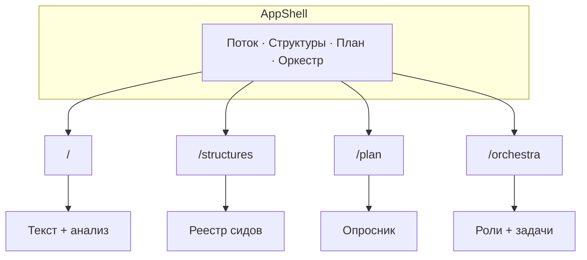

# Обзор интерфейса репозитория model

**Версия:** 2026-05-16 (слияние черновика в репозитории и PDF «Обзор интерфейса репозитория model»).  
При расхождении с кодом приоритет у `web/src/routes/*`, сторов и `web/src/lib/*`.

## Как читать этот документ

| Режим | Разделы |
|-------|---------|
| **Онбординг** (новый человек за 30–60 мин) | Паспорт → IA → сквозные сценарии → первый час |
| **Справочник** (ежедневная работа) | Карта данных → экраны 4–7 → действия → JSON |
| **Связь с каноном «Мастер»** | Паспорт, глоссарий; каноны — контекст продукта, не имя репозитория |

**Для кого:** владелец репозитория, ассистент в Cursor, будущий разработчик — **без** чтения TSX и вёрстки.

> **Имя репозитория и кода — `model`.** «Мастер», «Проект Мастер» в PDF-канонах — продуктовая идея, не название этой кодовой базы.

Документ описывает **смысл UI**, потоки, данные и ограничения. Не описывает Tailwind, структуру компонентов и фрагменты кода.

---

## 0. Паспорт продукта

### Что это

Локальное веб-рабочее место в каталоге `web/`:

- структурирование текста («поток сознания»);
- локальный анализ и внешний JSON-слой;
- реестр структур из промптов (сиды);
- опросник плана с экспортом;
- оркестр ролей и задач для параллельной работы в IDE.

**Стек:** Vite, React, TypeScript, Tailwind, `react-router-dom`, `zustand` + `localStorage`.  
**Запуск:** `cd web && npm install && npm run dev` → URL в терминале (обычно `http://localhost:5173/`).

### Что это не

- не запускает агентов Cursor из браузера;
- не облачный SaaS и не синхронизация между устройствами;
- не готовая соцсеть;
- не полноценный бэкенд (есть заготовка `api/` с `GET /health`).

### Роли

| Роль | В UI |
|------|------|
| **Владелец** | Текст, план, оркестр, экспорт в чат |
| **Ассистент в IDE** | Не видит `localStorage`; только файлы/копипаст |
| **Разработчик** | `web/src`, сиды, каноны в корне Git |

### Термины канона в языке UI

| Термин | В текущем UI |
|--------|----------------|
| **Слой** | Отдельный смысловой уровень данных (локальный vs внешний анализ) |
| **Субъект** | Участник будущей модели доступа; в UI пока не полноценная роль |
| **Раскрытие** | Контролируемая передача наружу: экспорт JSON, «Снимок браузера» |

---

## 1. Карта информационной архитектуры

### Экранный реестр

| Маршрут | Вкладка | Файл экрана | Зачем |
|---------|---------|-------------|--------|
| `/` | Поток | `web/src/routes/StreamWorkspace.tsx` | Сырой текст, локальный и внешний анализ, каноны |
| `/structures` | Структуры из промптов | `web/src/routes/PromptStructuresWorkspace.tsx` | Опорные каркасы из промптов |
| `/plan` | План: вопросы | `web/src/routes/PlanningQuestionnaireWorkspace.tsx` | Устойчивые ответы, JSON |
| `/orchestra` | Оркестр | `web/src/routes/OrchestraWorkspace.tsx` | План дорожек без запуска агентов |

**Оболочка:** `web/src/layouts/AppShell.tsx` — sticky-шапка «Рабочее место», четыре вкладки, skip-link **«К основному содержимому»** → `#main-content`. **Нет** логина и мультитенанта.

### Глобальные паттерны

| Паттерн | Назначение |
|---------|------------|
| **AppButton** | `primary` / `ghost` (с рамкой) / `danger` |
| **SurfaceCard** | Секция с заголовком |
| **ConfirmDialog** | `<dialog>` для опасных действий |
| **downloadJson** | Скачивание JSON без сервера |

Тёмная тема: `color-scheme: dark` в `index.html`.

---

## 2. Сквозные пользовательские сценарии

Сценарии проходят через **несколько вкладок** — так видна роль каждого раздела.

### A. Подготовка анализа и плана

1. **Поток** — вставить текст → **Локальный анализ**.  
2. **Структуры** — выбрать рамку (тег `analysis`, `product`, …).  
3. **План** — зафиксировать ответы → **Экспорт JSON**.  
4. Передать `plan-answers-*.json` в чат.

### B. Канон из Git и передача ассистенту

1. Открыть `CANON_*.txt` в IDE → скопировать фрагмент в **Поток** (без автозагрузки).  
2. **Канон-2** или **Проект Мастер (PDF) в слой** / свой JSON.  
3. При локальном анализе — ссылки с тем на блоки `#analysis-block-N`.  
4. **Оркестр** — задачи и заметки дирижёра.  
5. **Снимок браузера** → чат Cursor.

### C. Параллельная организация работы

1. **Оркестр** — роли и задачи по статусам.  
2. **Поток** — контекст по задаче.  
3. **План** — стабильные решения.  
4. **Структуры** — шаблон запроса агенту.  
5. Экспорт оркестра и/или снимок браузера.

---

## 3. Карта данных

### Таблица хранения

| Данные | Где | Ключ / источник | Отдельный экспорт | В снимке браузера |
|--------|-----|-----------------|-------------------|-------------------|
| Текст потока | `localStorage` | `model-stream-v1` | В analysis-snapshot | `stream.masterRawText` |
| Локальный + внешний анализ | `localStorage` | `model-analysis-v1` | «Экспорт JSON» | `analysis` |
| Ответы плана | `localStorage` | `model-planning-v1` | `plan-answers-*.json` | `planning` |
| Оркестр | `localStorage` | `model-orchestra-v1` | `orchestra-*.json` | `orchestra` |
| Сиды структур | Код | `promptStructureSeeds.ts` | — | — |
| Каноны, SWOD, план | Git | корень `model` | Ручная вставка в Поток | Только если вставлено |
| `private/*` | Диск владельца | вне Git | Не в UI | Нет |

**Важно:** очистка данных сайта в браузере удаляет persist. Агент **не** читает `localStorage`.

### Четыре контура (не путать)

| Контур | Что это | Как попадает информация |
|--------|---------|-------------------------|
| **Git-канон** | `CANON_*.txt`, SWOD, PLAN | IDE, репозиторий |
| **Браузер** | persist + поле потока | Работа во вкладках |
| **Экспорт** | JSON-файлы | Кнопки экспорта / снимок |
| **Ассистент** | Чат Cursor | Явная передача файла или текста |

### Границы доверия

| Граница | Смысл |
|---------|--------|
| Git ↔ UI | Каноны **не** подгружаются автоматически |
| Браузер ↔ ассистент | Нужен экспорт или снимок |
| UI ↔ `private/` | Private не описывается и не экспортируется UI |
| UI ↔ `api/` | Серверный контур — следующий этап (фаза 4–5 плана) |

---

## 4. Экран «Поток» (`/`)

### Назначение

Структурирование потока. **Два слоя анализа** (не одно и то же):

| Слой | Как получить | Зачем |
|------|--------------|--------|
| **Локальный** | Кнопка «Локальный анализ» | Быстрые метрики, блоки, ключевые слова в браузере |
| **Внешний** | JSON, «Канон-2», «Проект Мастер» | Глубокий разбор; темы, напряжения, гипотезы |

### Зоны интерфейса

1. Три обзорные карточки (мастер-текст / локальный слой / исследование).  
2. Карточка путей к `CANON_SECONDARY_MASTER.txt`, `CANON_PROJECT_MASTER.txt`, `SWOD_ZAKONOV.txt`.  
3. **Источник текста:** вставка, `.txt`, **Локальный анализ**, **Сбросить анализ…** (только слои анализа; **текст в поле остаётся**), **Экспорт JSON**, **Снимок браузера**.  
4. Метрики, ключевые слова, блоки с `id="analysis-block-N"`.  
5. Глубокий JSON: **Проект Мастер (PDF) в слой**, **Канон-2 (PDF) в слой**, ручной импорт.  
6. Внешний слой: темы + `ThemeBlockAnchors` → ссылки на блоки.

### How-to (кратко)

| Задача | Шаги |
|--------|------|
| Первый запуск | Вставить текст → локальный анализ → просмотреть блоки |
| Внешний слой | Канон-2/3 или JSON → проверить темы и якоря |
| Ассистенту | Заполнить вкладки → **Снимок браузера** |
| Канон из Git | IDE → копировать → вставить → анализ |

### Состояния и матрица «Поток»

| Ситуация | Пользователь видит |
|----------|-------------------|
| Пустое поле | Локальный анализ недоступен |
| Текст без анализа | Нужна кнопка «Локальный анализ» |
| Невалидный JSON | Красная плашка ошибки |
| `relatedBlockIndices` без локального анализа | Подсказка запустить локальный анализ |

| Срез | Пусто | Есть данные | Ошибка импорта |
|------|-------|-------------|----------------|
| Источник | Пустое поле | Текст есть | — |
| Локальный анализ | Нет | Блоки/метрики | — |
| Внешний анализ | Нет | Темы/гипотезы | Невалидный JSON |

---

## 5. Экран «Структуры из промптов» (`/structures`)

**Назначение:** библиотека **опорных каркасов** из подтверждённых промптов (закон 8 SWOD), не редактор проекта.

**Факты:** сиды из `DEFAULT_PROMPT_STRUCTURES`; в UI — **просмотр** (раскрывающийся список: `title`, `summary`, `sourceHint`, `id`, теги, дата). **Нет** пользовательского добавления/редактирования в интерфейсе.

**Сценарий:** `/structures` → найти сид по тегу → использовать формулировку в задаче агенту или при планировании на **Потоке** / **Плане**.

---

## 6. Экран «План: вопросы» (`/plan`)

**Назначение:** перманентный опросник (radio + **свой вариант**); ответы в `model-planning-v1`.

| Действие | Результат |
|----------|-----------|
| Экспорт JSON | `plan-answers-{timestamp}.json`, `version: 1` |
| Импорт JSON | Восстановление из поля под кнопками |
| Очистить ответы… | `ConfirmDialog` → пустые ответы |

| Состояние | Смысл |
|-----------|--------|
| Не заполнено | Готов к прохождению |
| Частично | Можно продолжить |
| После экспорта | Артефакт для Cursor |
| После очистки | Пустой `model-planning-v1` |

---

## 7. Экран «Оркестр» (`/orchestra`)

**Назначение:** планирование параллельных дорожек в IDE. Роли — **не** кнопка запуска subagent’ов.

| Сущность | Детали |
|----------|--------|
| Роли (шаблон) | explore, generalPurpose, shell, ci-investigator — подпись и «фокус» редактируются |
| Задачи | `backlog` · `in_progress` · `blocked` · `done` |
| Заметки дирижёра | Текстовое поле |
| Действия | Экспорт/импорт JSON, роли по умолчанию, **Полный сброс…**, карточка → `PLAN_REALIZATSII.md` |

| Состояние оркестра | Смысл |
|--------------------|--------|
| Пустой | Первичная настройка |
| Есть роли, нет задач | Рамка без разложения работ |
| Задачи по статусам | Рабочая «диспетчерская» |
| После экспорта | `orchestra-*.json` для чата |

---

## 8. Справочник действий

| Действие | Экран | Результат | Ключ / файл |
|----------|-------|-----------|-------------|
| Загрузить .txt | Поток | Текст в поле | `model-stream-v1` |
| Локальный анализ | Поток | Блоки, метрики | `model-analysis-v1` |
| Сбросить анализ… | Поток | Очистка local + external | `model-analysis-v1` |
| Экспорт JSON | Поток | `analysis-snapshot-*.json` | — |
| Снимок браузера | Поток | `workspace-browser-*.json` | все persist |
| Канон-2 / Проект Мастер в слой | Поток | Bundled ExternalAnalysisV1 | external в `model-analysis-v1` |
| Импортировать JSON | Поток | Ручной внешний слой | `model-analysis-v1` |
| Ссылка на блок #N | Поток | Scroll к `#analysis-block-N` | — |
| Раскрыть структуру | Структуры | Детали сида | код |
| Экспорт / импорт / очистить | План | plan JSON | `model-planning-v1` |
| Добавить роль/задачу, статус | Оркестр | Обновление оркестра | `model-orchestra-v1` |
| Экспорт оркестра | Оркестр | `orchestra-*.json` | — |
| Полный сброс… | Оркестр | Шаблон по умолчанию | `model-orchestra-v1` |

---

## 9. Форматы JSON (верхний уровень, по коду)

### ExternalAnalysisV1

`version: 1`, `generatedAt`, `summary`, `themes[]` (`id`, `title`, `rationale`, опц. `relatedBlockIndices`), `tensions[]`, `hypotheses[]`, опц. `modelHint`.

### Снимок анализа («Экспорт JSON» на Потоке)

`version: 1`, `exportedAt`, `rawText`, `local`, `external`.

### План (`plan-answers-*.json`)

`version: 1`, `exportedAt`, `answers`: `{ questionId: { optionId, customText } }`.

### Оркестр (`orchestra-*.json`)

`version: 1`, `exportedAt`, `agents[]`, `tickets[]`, `conductorNotes` — не `roles`/`tasks`.

### Снимок браузера (`workspace-browser-*.json`)

`version: 1`, `exportedAt`, `note`, `stream`, `analysis`, `planning`, `orchestra` — см. `web/src/lib/workspaceBrowserSnapshot.ts`.

---

## 10. Доступность (a11y)

Реализовано (не полный WCAG-аудит):

- skip-link к `#main-content`;
- `<main tabIndex={-1}>`;
- `ConfirmDialog` с `aria-modal`, подписями;
- кнопки с `min-h-10`, `focus-visible:ring`;
- якоря блоков с `scroll-mt` под sticky-шапку.

Ожидание: основные сценарии без мыши; разрушительные действия только после подтверждения.

---

## 11. Границы, риски, будущее

- **Local-first** — нет sync между устройствами.  
- **Агенты** — оркестр = план; исполнение в IDE.  
- **`api/`** — `GET /health` на `:3847`; NestJS/Keycloak/OpenFGA — **запланировано** (`PLAN_REALIZATSII.md`, фазы 4–5).

---

## 12. Глоссарий

| Термин | Значение |
|--------|----------|
| **model** | Репозиторий и локальный web UI |
| **Мастер** | Продуктовый замысел из канонов |
| **Поток** | Экран `/`, сырой текст и анализ |
| **Локальный / внешний слой** | Внутренний конвейер vs JSON |
| **Снимок браузера** | `workspace-browser-*.json` |
| **Канон-2 / канон-3** | Git-тексты + кнопки на Потоке |
| **Сид** | Запись в `promptStructureSeeds.ts` |
| **Оркестр / дирижёр** | Координация ролей и задач |
| **model-stream-v1** … **model-orchestra-v1** | Ключи persist |
| **Раскрытие** | Экспорт и снимок наружу |
| **Local-first** | Данные прежде всего в браузере |

---

## 13. Первый час

1. `cd web && npm install && npm run dev` → открыть localhost.  
2. **Поток:** текст → **Локальный анализ** → **Канон-2 (PDF) в слой**.  
3. **План:** 2–3 ответа → **Экспорт JSON**.  
4. **Оркестр:** одна задача, роль «Исследование».  
5. **Поток** → **Снимок браузера**.

**Минимум для чата ассистенту:**

- `workspace-browser-*.json` (или analysis-snapshot);
- при необходимости `plan-answers-*.json`, `orchestra-*.json`;
- одна строка: что сделать с файлами.

---

## 14. Связанные документы

| Документ | Путь от `web/docs/` |
|----------|---------------------|
| Стек, команды, CI | `../README.md` |
| Законы | `../../SWOD_ZAKONOV.txt` |
| Дорожная карта | `../../PLAN_REALIZATSII.md` |
| API-заготовка | `../../api/README.md` |
| Каноны | `../../CANON_SECONDARY_MASTER.txt`, `../../CANON_PROJECT_MASTER.txt` |

---

## История версий обзора

| Дата | Источник |
|------|----------|
| 2026-05-16 | Первый черновик в репозитории (по коду) |
| 2026-05-16 | Слияние с PDF «Обзор интерфейса репозитория model» (сквозные сценарии, матрицы состояний, контуры данных; JSON уточнены по коду) |
